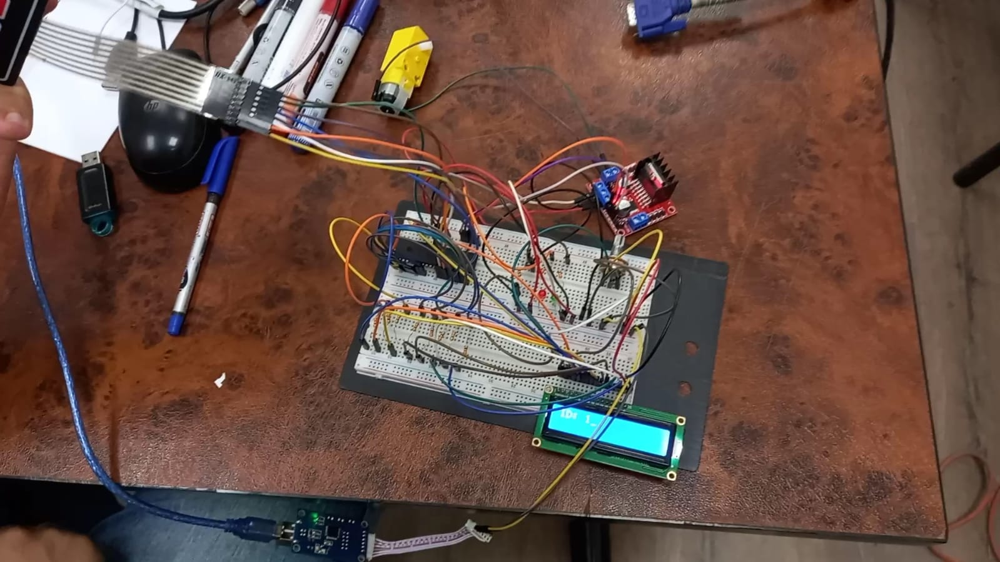

# Smart Door Control System Using AVR

## Project Overview
This project implements a **Smart Door Control System** on an ATmega32A microcontroller, using an ID and password for secure unlocking. It includes:
- **LCD** for displaying prompts and feedback
- **Keypad** for user input
- **DC Motor** to simulate door operation

Developed using **Microchip Studio**, the project is simulated in **Proteus** and implemented in hardware for reliable, real-world testing.

## Features
- **Authentication**: ID and password required for unlocking.
- **User Interface**: LCD displays prompts and feedback.
- **Simulation and Hardware**: Developed for both software simulation and physical testing.

## Getting Started

### Prerequisites
To run or modify this project, you will need:
- **Microchip Studio** for compiling and uploading the code
- Basic components, including ATmega32A, LCD, Keypad, and DC motor (for hardware setup if implemented)

### Installation
1. Clone this repository:
   ```bash
   git clone https://github.com/Ahmed-Hassan-Ibrahim/Smart-Door.git
   ```
2. Open the project in **Microchip Studio** to view or edit the C code.

## Media
### Proteus Simulation


### Hardware Implementation
 


